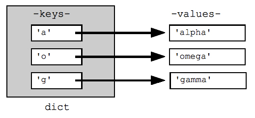

% Minimal slide demo
% **Lex Nederbragt**
% Jul 3, 2017

<!-- !split -->

### Plain text

Here is some plain text.

Now we add some python code with output:


```python
total = 0
for number in range(10):
   total = total + (number + 1)
print(total)
```

```
55
```

<!-- !split -->

### Explanation

Let's explain some of this code
(setting the code to be unexecutable):

The `for` loop:


```
for number in range(10):
   total = total + (number + 1)
```

Goes through numbers 0 to 9 and adds 1 more than each number to the `total` variable.

<!-- !split -->
### Table

The data on exponential growth can be found in the table below.

<table border="1">
<thead>
<tr><th align="center">time</th> <th align="center">  count  </th> </tr>
</thead>
<tbody>
<tr><td align="center">   60      </td> <td align="center">   10000        </td> </tr>
<tr><td align="center">   90      </td> <td align="center">   25587        </td> </tr>
<tr><td align="center">   120     </td> <td align="center">   76327        </td> </tr>
<tr><td align="center">   150     </td> <td align="center">   212715       </td> </tr>
<tr><td align="center">   180     </td> <td align="center">   619511       </td> </tr>
<tr><td align="center">   210     </td> <td align="center">   1940838      </td> </tr>
<tr><td align="center">   240     </td> <td align="center">   4240760      </td> </tr>
<tr><td align="center">   270     </td> <td align="center">   13993730     </td> </tr>
<tr><td align="center">   300     </td> <td align="center">   38971086     </td> </tr>
<tr><td align="center">   330     </td> <td align="center">   105614040    </td> </tr>
</tbody>
</table>
<!-- !split -->
### Figure

See [figure](#PythonDict) for an illustration that explains the python dictionary concept.

<!-- <p><em>Data structure concept of a dictionary in python. <div id="PythonDict"></div></em></p> -->


The figure was taken
[from Wikimedia Commons](https://commons.wikimedia.org/wiki/File:GooglePythonClass_Day1_Part3_Pic.jpg).
<!-- !split -->

### Math

Now we add some mathematical formula:

$$

K_n = rwTK_{n-1}\left (1 - \frac{K_{n-1}}{H}\right ) - K_{n-1}.

$$

